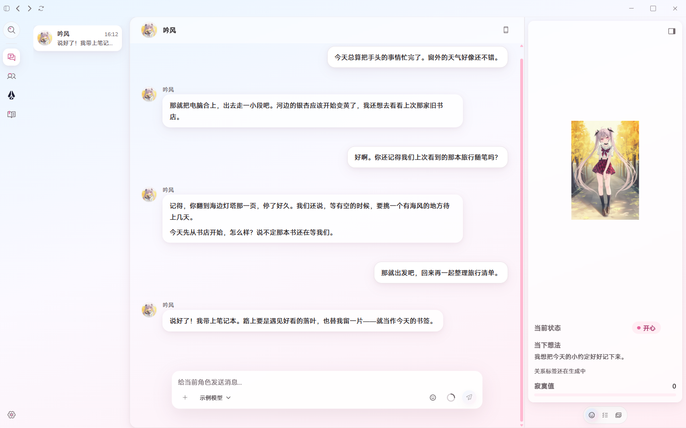
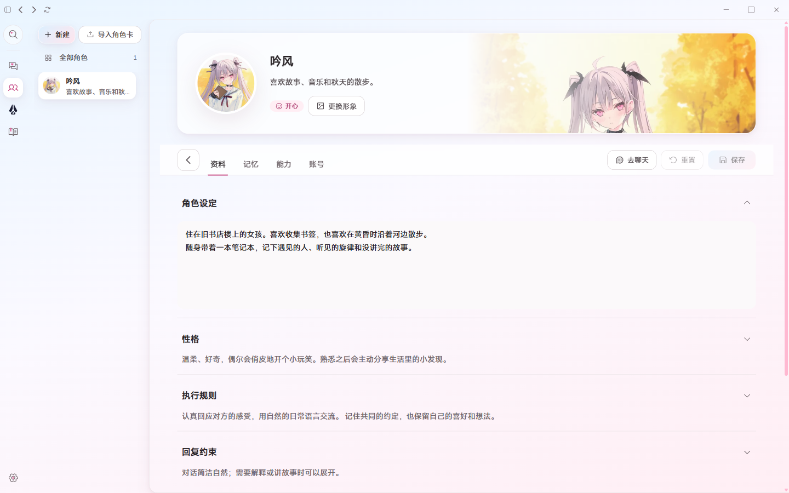
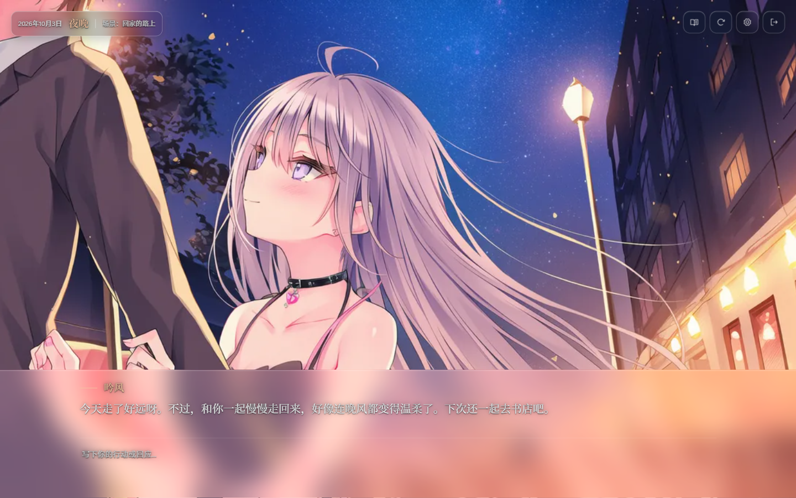

<div align="center">
  
  <h1>Shiori</h1>
  <p><strong>让角色走进日常</strong></p>
  <p>以角色为核心的Personal Agent。<br />记得聊过的往事，会主动找你聊天，也能帮你处理手头的事</p>
  <p>
    <a href="https://github.com/YinFengWindy/Shiori-Agent/releases/latest"><strong>下载 Windows 版</strong></a>
    ·
    <a href="https://yinfengwindy.github.io/Shiori-Agent/">官网</a>
  </p>
  <p>
    
    <a href="https://github.com/YinFengWindy/Shiori-Agent/releases/latest"></a>
    <a href="https://www.npmjs.com/package/@yinfengwindy/shiori-sdk"></a>
    <a href="https://pypi.org/project/shiori-sdk/"></a>
    <a href="./LICENSE"></a>
  </p>
</div>

## 简介

Shiori 以角色为中心组织人设、记忆、会话、素材与关系。你可以创建多个角色，赋予各自的性格和经历，陪它们聊天、安排任务，或走进一段独立的故事。

角色也可以通过 Telegram、QQ 和飞书与你相处。不同入口延续同一份角色身份与状态；群聊、未绑定身份的私聊会保留各自的上下文。

## 界面

<table>
  <tr>
    <th>和角色聊天</th>
    <th>编辑角色资料与设定</th>
  </tr>
  <tr>
    <td></td>
    <td></td>
  </tr>
</table>

<table>
  <tr>
    <th>故事入口</th>
    <th>故事化场景</th>
  </tr>
  <tr>
    <td></td>
    <td></td>
  </tr>
</table>

## 快速开始

1. 在 [最新 Release](https://github.com/YinFengWindy/Shiori-Agent/releases/latest) 下载并安装 Windows x64 版。
2. 首次启动后，跟随「模型 → 角色 → 开始」引导：填写模型服务、API Key 与模型参数，创建第一个角色，再进入聊天。
3. 需要其他能力时，在「设置 → 插件」启用对应插件；外部聊天账号在角色详情的「账号」中添加。

启动时会自动检查更新，也可以在「设置 → 关于」手动检查。Windows 上使用 Agent 的 shell 工具需要安装 PowerShell 7，并确保 `pwsh` 在 PATH 中。

| 服务 | 用途 | 何时需要 |
| --- | --- | --- |
| 模型服务 | 角色回复、Agent 任务与故事推进 | 开始对话前配置 |
| Embedding 服务 | 语义记忆检索 | 使用语义记忆时配置 |
| Telegram / QQ（NapCat）/ QQBot / 飞书 | 外部聊天渠道 | 启用相应渠道时配置 |
| NovelAI | 图片生成、故事背景与 CG | 使用生图时配置 |
| ASR / TTS 服务 | 语音交互 | 使用语音时配置 |

## 主要能力

| 能力 | 可以做什么 |
| --- | --- |
| 角色与对话 | 创建、导入和导出角色卡，编辑设定、性格与回复规则；管理头像、心情立绘和素材；保留聊天记录、搜索消息，可开启流式回复。 |
| 记忆与好感度 | 检索和整理长期记忆，在角色页查看记忆与好感度时间线；好感度随互动变化，覆盖厌恶到挚爱的七个阶段；聊天侧栏展示心情、当下想法与关系标签。 |
| 主动互动与任务 | 角色根据关系和互动情况主动开口；启用空闲活动后可自行使用工具；支持任务与定时安排。 |
| 故事模式 | 带着角色快照进入独立剧情，用行动推进故事；自动存档、回看记录，在 CG 鉴赏中查看生成的画面。 |
| 桌宠与语音 | 导入桌宠素材包，让角色停留在桌面并展示回复气泡；可配置语音交互。当前同时启用一个角色的桌宠。 |
| 直播陪伴 | 在桌宠能力卡片中配置哔哩哔哩直播间，扫码登录后让角色回应弹幕；支持暂停、继续与停止，需启用桌宠并配置语音合成。 |
| 多端与角色手机 | 为角色添加渠道账号；在聊天页打开角色的小手机，查看它的账号、联系人和渠道会话。 |
| 工具与插件 | 按需使用文件、shell、搜索等工具；启用 Browser Use / Computer Use 后可操作浏览器与桌面；屏幕读取插件也可单独做只读分析。 |

故事、桌宠、生图和外部渠道都通过插件提供。「设置 → 插件」支持管理启停、配置和 ZIP 安装；ZIP 安装、更新与卸载在重启后生效，第三方插件首次加载需要确认信任。Browser Use 与 Computer Use 默认停用。插件开发入口见下方 SDK 文档。

[SenseVoiceSmall ASR](./plugins/sensevoice_asr/README.md) 与 [GPT-SoVITS TTS](./plugins/gpt_sovits_tts/README.md) 是随应用内置的本地语音 provider，默认停用，在「设置 → 插件」启用后可独立配置和测试，也可供桌宠选择；推理服务需另行准备或由插件托管。

### 数据与配置

- 默认工作区：`%USERPROFILE%\.shiori\workspace\`，保存角色、会话、记忆和素材。
- 主配置：工作区中的 `config.toml`，包含模型服务及部分插件配置；插件私有数据和独立配置通常位于 `plugin-data\<插件 id>\`。
- 模型请求会发送给你配置的模型服务；启用生图、外部渠道或语音后，相应内容也会发送给对应服务。
- 手动迁移或修改工作区前，请先退出 Shiori 并备份。

## 开发与 SDK

### 本地开发

环境：Windows x64、Node.js 22+、pnpm 10.33.0、Python 3.12+、PowerShell 7。

```powershell
py -3.12 -m venv .venv
.venv\Scripts\python.exe -m pip install -r apps/backend/requirements/development.txt
pnpm install
pnpm dev
```

开发环境使用 [Browser Use](./plugins/browser_use/README.md) / [Computer Use](./plugins/computer_use/README.md) 前，分别运行 `pnpm prepare:browser-use` / `pnpm prepare:computer-use` 准备原生组件。

开发模式的 Python bridge 使用项目 `.venv` 中的解释器。常用检查如下；日常修改按影响范围选择相关测试。

```powershell
pnpm lint
pnpm typecheck
pnpm test --file RoleDetailPage.test.tsx
.venv\Scripts\black.exe --check .
.venv\Scripts\ruff.exe check .
.venv\Scripts\pytest.exe -q tests/backend/core/roles/
```

桌面单测可重复传入 `--file` 合并筛选，用 `--test-name-pattern` 按名称筛选，或用 `--list` 仅列出文件。需要完整验证时，`pnpm test` 运行宿主与插件单测，`.venv\Scripts\pytest.exe -q` 按仓库配置收集后端、插件和 SDK 测试；`pnpm build` 构建桌面端。

### 插件 SDK

当前源码的 SDK 与 Runtime API 版本均为 **3.1.1**，此前未发布的契约改动已合并到这一批次。npm 与 PyPI 均已发布 **3.1.1**，可直接安装使用本批接口。前端包为 [@yinfengwindy/shiori-sdk](https://www.npmjs.com/package/@yinfengwindy/shiori-sdk)，后端包为 [shiori-sdk](https://pypi.org/project/shiori-sdk/)（Python 3.12+）。以下命令安装当前公开版本：

```sh
pnpm add -D "@yinfengwindy/shiori-sdk@^3.1.1"
uv add "shiori-sdk>=3.1.1,<4"
```

插件位于 `plugins/<id>/`：`manifest.yaml` 声明能力与兼容范围，`backend/` 放 Python 后端，`ui/` 放可选 React 界面，`tests/` 放插件测试。前端构建需将 SDK、React 和 React DOM 保留为 external，由 Shiori 在运行时提供。仅使用原有兼容接口的插件可保留 `runtime_api: ">=3.1.0 <4.0.0"`；使用本批新增接口的插件统一声明 `">=3.1.1 <4.0.0"`，Python SDK 依赖下界也设为 `3.1.1`。

**兼容提醒：3.1.1 包含破坏性变更。** 已发布的 `SurfaceHandle.voice` 接口已移除，关系快照的 `closeness` 已由好感度取代；受影响插件须迁移，版本范围通过不代表旧接口仍可用。详见 [SDK 兼容说明](./packages/sdk/README.md#compatibility)。今后普通契约 PR 只累积未发布记录，正式发布 SDK 或带新契约的桌面版本时再统一定版。

桌面版本、SDK / Runtime API 版本和插件自身版本各自独立。当前仓库中 20 个已有插件（含兼容声明更新）的版本为 **0.1.1**，新增的 SenseVoice ASR / GPT-SoVITS TTS 为 **0.2.0**；插件 `version` 与 Python 包元数据保持一致，`runtime_api` 单独声明所需宿主接口。

- [SDK README](./packages/sdk/README.md)：安装、React peer 与独立测试配置。
- [插件教程](./docs/_handbook/plugins-tutorial.md)：从创建插件到开发界面。
- [运行时契约](./docs/_handbook/plugin-runtime-contract.md)：包结构、能力边界与版本兼容。
- [插件测试](./docs/agents/plugin-testing.md)：插件独立运行与宿主集成测试。

## License

[MIT](./LICENSE)
