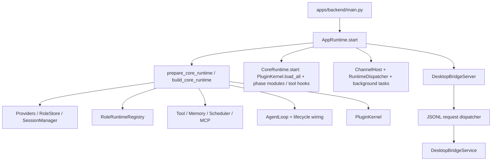
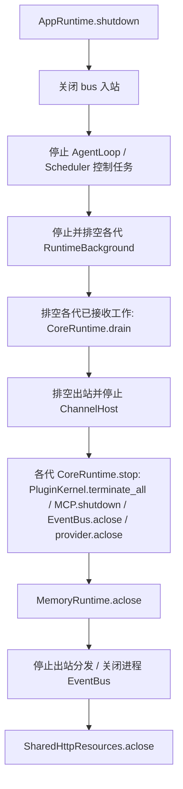

# 当前后端架构基线

本文记录 Python backend 的实际运行边界。Shiori 保留 Python 后端，插件内核自行实现（`apps/backend/agent/plugin_host/`），不引入外部插件框架。

## 进程与装配

`apps/backend/main.py` 的 `serve_bridge()` 先恢复未完成的配置事务（`ConfigTransaction.recover()`）并应用待处理的插件包安装/卸载操作，再构建 `AppRuntime`。`apps/backend/bootstrap/app.py` 的 `AppRuntime.start()` 经 `bootstrap/runtime/construction.py:prepare_core_runtime()` 调用 `apps/backend/bootstrap/tools.py:build_core_runtime()` 装配一代 `CoreRuntime`（构建失败时回收已分配资源）。CoreRuntime 持有 AgentLoop、MessageBus、EventBus、ToolRegistry、SessionManager、Scheduler、LLMProvider、MemoryRuntime、PresenceStore、RoleRelationshipRuntimeService、RoleRuntimeRegistry、GroupEnvironment、群聊旁听开关、MCP 和 PluginKernel。



事实依据：`apps/backend/main.py` 的 `serve_bridge()`、`apps/backend/bootstrap/app.py` 的 `AppRuntime.start()`、`apps/backend/bootstrap/tools.py` 的 `CoreRuntime` 与 `build_core_runtime()`。

## 运行时换代

`AppRuntime` 不在设置变更时重启进程。`apps/backend/bootstrap/runtime/` 中：

- `GenerationManager` / `RuntimeCandidate` 管理按引用计数的多代 `CoreRuntime`；`RuntimeLease` 把一个任务固定在开始时选中的那一代。
- `RuntimeReloadMixin.prepare()` / `publish()` 由设置事务边界（`desktop_bridge/runtime/apply.py`）调用：先构建新一代，再切换发布指针，旧代在已接收工作排空后关闭（`CoreRuntime.stop()` + `MemoryRuntime.aclose()`）。
- `RuntimeDispatcher` 是 bus 的唯一消费者，为每条渠道消息获取租约后交给当代 `AgentLoop.process_inbound()`；定时任务与子回合沿用父操作的那一代。
- `RuntimeBackground` 为每一代准备主动循环与记忆优化任务，在上一代后台工作排空后才接管调度。
- `ChannelHost`（`bootstrap/channel_host.py`）是跨代长驻的渠道宿主，负责渠道启动、交接与失败快照。

## Bridge 与消息入口

Electron main 通过 `apps/desktop/src/bridge/bridgeClient.ts` 启动 Python bridge，使用 stdin/stdout JSONL。`apps/backend/desktop_bridge/server.py` 负责解析请求、并发分发、串行写回 response/event，并在退出时关闭 dispatcher、service 和 writer。

桌面聊天的实际路径是 `DesktopBridgeService -> DesktopChatService -> AgentLoop.process_direct`，不经过 `MessageBus`。渠道输入经过 bus，由 `RuntimeDispatcher` 交给 `AgentLoop.process_inbound()`。两条路径最终都进入 `RoleRuntimeRegistry.dispatch_passive_turn()` 的 role-scoped processing。

## RoleRuntime 与唯一角色会话

`RoleRuntimeRegistry` 按 `role_id` 缓存一个稳定 `RoleRuntime`。`RoleRuntime` 以角色为并发边界，使用一把 role-wide turn lock（`RoleExecutionState.turn_lock`，跨运行时代共享）串行化 passive turn、proactive tick、background task 和 role state 操作；每次操作释放锁后发布一次 `ContextWindowChanged`。`RoleExecutionContext` 校验 role、config version、thread、transport、source 和 work kind。

角色会话 key 为 `role:{role_id}`。角色与唯一活跃会话是同一生命周期边界，不存在独立的 Session Plugin 产品概念。角色删除先删除角色记录，再删除 role session，最后通知 role-deleted 监听器级联清理角色记忆和其他 role-owned 状态；监听器未注册时直接报错。

事实依据：`apps/backend/core/roles/role_runtime.py` 的 `RoleRuntime.execute_thread()` 与 `RoleRuntimeRegistry`、`apps/backend/session/manager/role_sessions.py`、`apps/backend/core/roles/services.py` 的 `RoleAggregateService.delete_role()`。

## 被动回合

```mermaid
flowchart TD
  A[DesktopBridge request] --> B[DesktopChatService]
  B --> C[AgentLoop.process_direct]
  A2[Channel inbound via bus] --> C2[RuntimeDispatcher -> AgentLoop.process_inbound]
  C --> D[role:{id} Session + RoleExecutionContext]
  C2 --> D
  D --> E[RoleRuntimeRegistry.dispatch_passive_turn]
  E --> F[PassiveTurnPipeline]
  F --> G[BeforeTurn]
  G --> H[BeforeReasoning]
  H --> I[Reasoner: prompt / budget / retry / tool loop]
  I --> J[ToolRegistry / Executor / hooks]
  J --> I
  I --> K[AfterReasoning: parse / persist / outbound]
  K --> L[AfterTurn / TurnCommitted]
  L --> M[Session and bridge events]
```

`apps/backend/agent/core/passive_turn/pipeline.py` 的 `PassiveTurnPipeline` 定义 phase 顺序：BeforeTurn、BeforeReasoning、Reasoner（内部执行 BeforeStep/AfterStep 与 PromptRender 模块）、AfterReasoning、AfterTurn。请求超出 `model_context_window` 推导的输入预算时，由 `passive_turn/budgeted_request.py`、`passive_turn/compaction.py` 与 `apps/backend/core/compaction.py` 的 `CompactionController` 处理压缩。Provider 或 reasoner 错误进入用户可见 fallback；AfterReasoning 和 AfterTurn 的权威持久化错误继续向边界冒泡。桌面流事件由 `apps/backend/desktop_bridge/chat_service.py` 发出，包括 `chat.delta`、`chat.tool.started`、`chat.tool.completed`、`chat.done` 和 `chat.error`。

LLM 调用由 `apps/backend/agent/provider.py` 封装，使用官方 `openai` SDK 的 Chat Completions 兼容接口，负责各厂商安全错误、上下文超长错误识别、重试与 usage 记录。

## 主动回合与后台任务

`apps/backend/proactive_v2` 根据时间、presence、关系和观察结果生成 tick。`apps/backend/bootstrap/proactive.py` 的 `build_proactive_runtime()` 为角色创建主动循环（由 `RuntimeBackground` 按代调度），tick dispatcher 通过 `RoleRuntimeRegistry.dispatch_proactive_tick()` 进入同一角色 runtime，并在角色桌面线程 `role:<id>` 下执行。后台任务和 drift 使用同一套 role/session/tool 基础设施；定时任务经 `RuntimeDispatcher.run_role_operation()` 固定在所属运行时代。

## 工具、Memory 与插件

- `ToolRegistry` 保存工具、schema、风险、always-on、搜索索引和 source metadata；MCP 工具也同步到该 registry。内置 toolset 由 `apps/backend/bootstrap/toolsets/` 注册。
- 记忆契约 `MemoryEngine`、`MemoryQuery`、`MemoryQueryResult`、`MemoryMutation` 定义在 SDK 的 `packages/sdk/python/shiori_sdk/memory/`；`apps/backend/core/memory/` 的 `MemoryRuntime` 组合宿主 Markdown 记忆与所选 engine，默认 engine 位于 `plugins/default_memory/backend/`，由 `bootstrap/wiring.py` 的 `resolve_memory_plugin()` 加载。
- `PluginKernel` 同时负责 discover/import/config/context 注入、EventBus handler、tool、tool hook、phase module、proactive gate、channel、bot command、RPC、服务注册、initialize rollback、drain 和 terminate。
- `ScopedEventBus` 将每个事件订阅注册到所属 `EffectScope`，插件卸载和初始化回滚会撤销贡献；已经开始的 handler 由插件 disposer 等待或取消。

## 持久化边界

- 角色配置、绑定和素材：`apps/backend/core/roles/` 与 RoleStore facade。
- Session metadata/messages：`apps/backend/session/` 的 SQLite store；消息可能含 `tool_chain`、reasoning 和 proactive metadata。
- Conversation：`apps/backend/conversation/` 负责 legacy session key 到正式 thread 的映射，以及群聊旁听数据。
- 角色记忆：`workspace/roles/{role_id}/memory` 及具体 MemoryStore/索引。
- 插件配置在主 TOML 的 `[plugins.<id>]`；KV 与私有持久化文件位于 `workspace/plugin-data/<id>/`；外部安装的插件包位于 `workspace/plugins/`。

## 关闭流程

`AppRuntime.shutdown()`（`bootstrap/runtime/shutdown.py`）按以下顺序执行，单步失败不阻止后续步骤，错误最终聚合抛出：



## 待验证项

- Proactive、scheduler 和所有 background task 是否都严格共享同一 RoleRuntime lock。
- DesktopBridge 每个 RPC method 到 request handler 的完整映射。
- 插件热换代的跨渠道竞态需结合各 owning module 的生命周期测试与运行 trace 验证。
- 渠道 bus 路径与 DesktopBridge direct path 在所有渠道上的行为差异。
