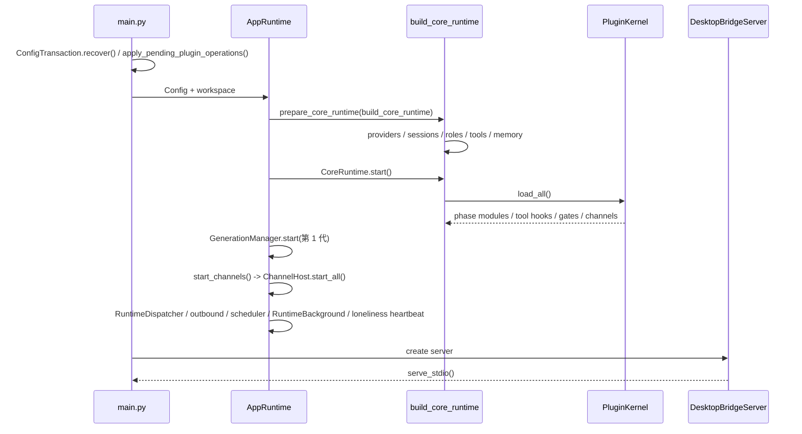

# 启动与关闭流程

## 当前启动



`serve_bridge()` 运行期间把进程 stdout 重定向到 stderr，stdout 只留给 JSONL 协议。Python bridge 的 readiness 由 Electron `DesktopBridgeClient` 轮询 `health` 完成，`restart()` 负责重启子进程。

设置保存不重启进程：`AppRuntime.prepare()` 构建新一代 `CoreRuntime`，`publish()` 切换后旧代排空后关闭（见 [当前后端架构](../architecture/current-backend.md#运行时换代)）。

## 当前关闭

```mermaid
sequenceDiagram
  participant App as AppRuntime
  participant Loop as Bus / AgentLoop / Scheduler
  participant Gen as 各代 CoreRuntime
  participant Plugin as PluginKernel
  participant Store as Channels / Memory / HTTP
  App->>Loop: close inbound, stop control tasks
  App->>App: stop and drain RuntimeBackground
  App->>Gen: drain accepted work
  App->>Loop: drain outbound
  App->>Store: ChannelHost.stop_all()
  App->>Gen: stop(force)
  Gen->>Plugin: terminate_all()
  Gen->>Gen: MCP shutdown / EventBus close / provider close
  Gen->>Store: MemoryRuntime.aclose()
  App->>Loop: stop outbound dispatch, close EventBus
  App->>Store: SharedHttpResources.aclose()
```

各步骤经 `run_cleanup_steps(..., aggregate_errors=True)` 执行，单步失败不阻止后续清理，错误最终聚合抛出。

`RoleRuntimeRegistry.close()` 关闭单个 RoleRuntime 时先 `begin_closing()` 拒绝新工作，再取消已登记的 active work；active work 仍未归零时直接抛错，不能静默结束。
