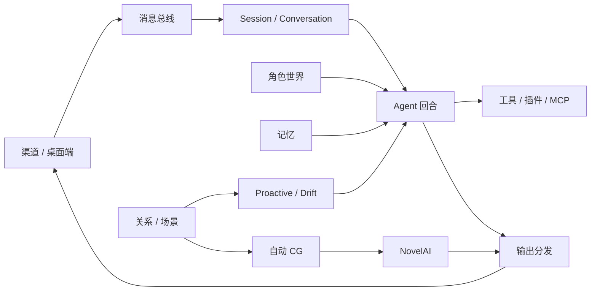

# Shiori 能力地图

| 领域 | Owning module | 主要下游 |
| --- | --- | --- |
| 应用启动与装配 | `main.py`、`bootstrap/app.py`、`bootstrap/wiring.py` | 渠道、Agent、角色世界、主动循环、桌面桥接 |
| 角色聚合 | `core/roles/store.py`、`core/roles/services.py`、`core/roles/world.py` | 会话绑定、关系、记忆、主动行为、桌面 UI |
| 关系与场景 | `core/roles/relationship_runtime/`、`core/roles/scene_followup_runtime.py` | 心情/寂寞、主动触发、场景追问、自动 CG |
| 会话 | `session/` | Agent 回合、在线状态、消息历史、搜索 |
| 对话持久化 | `conversation/` | 线程投影、旧数据迁移、跨入口消息连续性 |
| 记忆契约 | `core/memory/` | Agent 检索与生命周期插件 |
| 默认与增强记忆 | `plugins/default_memory/`、`memory2/` | 查询改写、召回、注入规划、响应后写入 |
| 主动行为 | `proactive_v2/` | 传感、裁定、Agent tick、投递、状态持久化 |
| Drift | `agent/core/drift_turn.py`、`proactive_v2/drift_state.py` | 特殊回合、工具、主动状态 |
| NovelAI | `core/integrations/novelai/` | 手动图片生成、自动 CG、桌面图片面板 |
| 自动 CG | `plugins/novelai/` | 场景判断、生成、消息推送、权威角色会话 |
| 渠道 | `infra/channels/`、`core/channels/hub.py`、`plugins/qqbot/` | 消息总线、会话定位、媒体发送 |
| Agent 回合 | `agent/core/`、`agent/turns/`、`agent/lifecycle/` | 上下文、推理、工具、输出、生命周期事件 |
| 工具、插件、MCP | `agent/tools/`、`agent/plugins/`、`agent/mcp/` | ToolRegistry、ToolExecutor、远端工具连接 |
| 调度任务 | `agent/scheduler.py`、`agent/tools/schedule.py`、`desktop_bridge/schedule_role_task_service.py` | 主动触发、角色任务、桌面展示 |
| 桌面桥接 | `desktop_bridge/` | Electron 主进程、React renderer、后端服务 |
| 桌面界面 | `desktop/src/`、`desktop/renderer/src/` | 角色管理、聊天、设置、图片、任务 |

