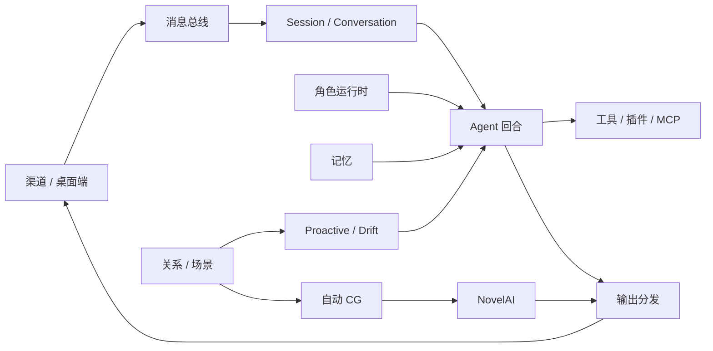

# Shiori 能力地图

| 领域 | Owning module | 主要下游 |
| --- | --- | --- |
| 应用启动与装配 | `apps/backend/main.py`、`apps/backend/bootstrap/app.py`（`AppRuntime`）、`apps/backend/bootstrap/tools.py`（`build_core_runtime` / `CoreRuntime`）、`apps/backend/bootstrap/wiring.py`（memory/context/toolset 注册表） | 渠道、Agent、角色运行时、主动循环、桌面桥接 |
| 运行时换代与热重载 | `apps/backend/bootstrap/runtime/`（`GenerationManager`、`RuntimeLease`、`RuntimeDispatcher`、`RuntimeBackground`、prepare/publish、关闭顺序） | 设置保存后的配置发布、渠道交接、后台任务交接 |
| 角色聚合 | `apps/backend/core/roles/store.py`、`apps/backend/core/roles/services.py`、`apps/backend/core/roles/role_runtime.py` | 会话绑定、关系、记忆、主动行为、桌面 UI |
| 关系与场景 | `apps/backend/core/roles/relationship_runtime/`、`apps/backend/core/roles/scene_followup_runtime.py`、`apps/backend/core/scene/` | 心情/寂寞、主动触发、场景追问、自动 CG |
| 会话 | `apps/backend/session/` | Agent 回合、在线状态、消息历史、搜索 |
| 对话持久化与群聊旁听 | `apps/backend/conversation/`（含 `listening*.py`） | 线程投影、旧数据迁移、跨入口消息连续性、群聊旁听窗口 |
| 上下文压缩 | `apps/backend/core/compaction*.py`（`CompactionController`）、`apps/backend/agent/core/passive_turn/compaction*.py`、`apps/backend/agent/prompting/input_budget.py` | 按 `model_context_window` 计算输入预算、自动/手动 `/compact`、上下文窗口展示 |
| 记忆契约 | `packages/sdk/python/shiori_sdk/memory/`（`MemoryEngine`、`MemoryQuery`、`MemoryMutation`）、`apps/backend/core/memory/`（`MemoryRuntime`、Markdown 记忆、群环境、角色记忆路径） | Agent 检索与生命周期插件 |
| 默认记忆引擎 | `plugins/default_memory/backend/`（`engine/` 查询与写入策略，`semantic/` 向量存储、召回、响应后写入；原 `memory2` 已并入此处） | 查询与提取策略、向量存储、召回与上下文注入、响应后写入 |
| 主动行为 | `apps/backend/proactive_v2/` | 传感、裁定、Agent tick、投递、状态持久化 |
| Drift | `apps/backend/agent/core/drift_turn.py`、`apps/backend/proactive_v2/drift_state.py`、`apps/backend/proactive_v2/drift_tools.py` | 特殊回合、工具、主动状态 |
| NovelAI | `plugins/novelai/backend/`（`service.py`、`client.py`、`store.py`、`tool.py`、`rpc.py`）、`plugins/novelai/ui/` | 手动图片生成、自动 CG、桌面图片面板 |
| 自动 CG | `plugins/novelai/backend/auto_cg.py`、`plugins/novelai/backend/auto_cg_controller.py`，场景判断契约在 `apps/backend/core/scene/` | 场景判断、生成、消息推送、权威角色会话 |
| 渠道 | `apps/backend/infra/channels/`、`apps/backend/bootstrap/channels.py`、`apps/backend/bootstrap/channel_host.py`（`ChannelHost`）、`apps/backend/core/channels/hub.py`、`apps/backend/core/common/channel_directory.py`；合约在 `shiori_sdk.channels`；外部渠道全部是插件：`plugins/telegram/`、`plugins/qq/`、`plugins/qqbot/`、`plugins/feishu/` | 消息总线、会话定位、媒体发送、角色绑定 |
| 账号与身份 | `apps/backend/core/accounts/`、`apps/backend/agent/account_delivery/`、`apps/backend/core/identity/` | 渠道账号投递、用户身份配对 |
| Agent 回合 | `apps/backend/agent/core/`、`apps/backend/agent/looping/`、`apps/backend/agent/turns/`、`apps/backend/agent/lifecycle/` | 上下文、推理、工具、输出、生命周期事件 |
| 工具、MCP | `apps/backend/agent/tools/`、`apps/backend/agent/tool_hooks/`、`apps/backend/agent/mcp/`、`apps/backend/bootstrap/toolsets/` | ToolRegistry、ToolExecutor、远端工具连接 |
| 插件宿主与 SDK | `apps/backend/agent/plugin_host/`（`PluginKernel`）、`packages/sdk/`（`shiori_sdk`，版本源 `packages/sdk/python/shiori_sdk/_version.py`）、`packages/shiori-host-testing/` | 插件发现/加载/卸载、phase module、tool hook、渠道、RPC、服务注册 |
| 插件包管理 | `apps/backend/desktop_bridge/runtime/plugin_*.py`、`scripts/build-plugin.mjs`、`scripts/plugin-distribution.mjs` | 外部插件安装/卸载事务、信任、`workspace/plugins/` 与 `workspace/plugin-data/` |
| 调度任务 | `apps/backend/agent/scheduler.py`、`apps/backend/agent/tools/schedule.py`、`apps/backend/desktop_bridge/schedule_role_task_service.py`、`apps/backend/desktop_bridge/role_task_service.py` | 主动触发、角色任务、桌面展示 |
| 桌面桥接 | `apps/backend/desktop_bridge/` | Electron 主进程、React renderer、后端服务 |
| 桌面界面 | `apps/desktop/src/`、`apps/desktop/renderer/src/` | 角色管理、聊天、设置、图片、任务 |
| 官网 | `apps/site/`（Astro 静态站，`https://www.windchant.online`；设计 token、Tailwind 主题、场景背景直接引用 `apps/desktop/renderer/`） | Vercel 部署（`vercel.json`）、GitHub Pages 工作流（`.github/workflows/site-pages.yml`） |
| 单角色剧情 | `plugins/story/backend/`、`plugins/story/ui/`（依赖 NovelAI 插件） | 剧情事实、角色/玩家快照、提交事件、固定故事日期与“清晨/上午/下午/夜晚/深夜”五段时段时钟、桌面剧情界面 |
| 桌宠语音 | `plugins/desktop_pet/background/voice/`、`plugins/desktop_pet/backend/voice_rpc.py`、`plugins/desktop_pet/backend/voice_preferences.py`、`apps/desktop/src/native/`、`apps/desktop/renderer/src/voice/`；ASR/TTS provider 为 `plugins/sensevoice_asr/`、`plugins/gpt_sovits_tts/` | 录音、ASR、角色 Loop、按句 TTS、播放与中断 |

```mermaid
flowchart LR
    Channel["渠道 / 桌面端"] --> Bus["消息总线"]
    Bus --> Session["Session / Conversation"]
    Session --> Agent["Agent 回合"]
    Role["角色运行时"] --> Agent
    Memory["记忆"] --> Agent
    Agent --> Tools["工具 / 插件 / MCP"]
    Agent --> Output["输出分发"]
    Proactive["Proactive / Drift"] --> Agent
    Relationship["关系 / 场景"] --> Proactive
    Relationship --> AutoCG["自动 CG"]
    AutoCG --> NovelAI["NovelAI"]
    NovelAI --> Output
    Output --> Channel
```
